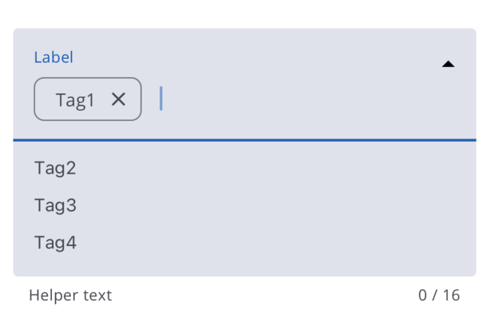

# AutoComplete

The Autocomplete is a component that features a standard text input accompanied by a list of suggested options. In this component, users can select an option from the available list. After selection, it will appear as a chip component with a delete icon inside the text input.



## Usage

```tsx
import { AutoComplete } from '@brightlayer-ui/react-native-components';

<AutoComplete helperText="helper text" label="label" value={['Tag1']} options={['Tag1', 'Tag2', 'Tag3', 'Tag4']} />;
```

#### Note: this component should be wrapped inside scroll view with the following props

```
   nestedScrollEnabled:true,
   keyboardShouldPersistTaps:"handled"
```

## API

<div style="overflow: auto">

| Prop Name              | Description                                                                                   | Type                          | Required | Default |
| ---------------------- | --------------------------------------------------------------------------------------------- | ----------------------------- | -------- | ------- |
| helperText             | Text to display the Helper Text                                                               | `string`                      | no       |         |
| label                  | Text to display as component label                                                            | `string`                      | no       |         |
| options                | List of Options to show in dropdown                                                           | `string[]`                    | no       |         |
| tagInputFieldProps     | Props to spread to the TextInput component                                                    | `TextInputProps`              | no       |         |
| chipProps              | Props to spread to the Chip component                                                         | `ChipProps`                   | no       |         |
| limitTags              | Number of Chip to be shown                                                                    | `number`                      | no       | 6       |
| limitCharacterCountTag | Number of character count for a Chip                                                          | `number`                      | no       | 16      |
| onChange               | Callback for when the text in the Textinput changes                                           | `function`                    | no       |         |
| onDelete               | Callback for when the chip close icon is clicked                                              | `function`                    | no       |         |
| disabled               | Prop to disable the AutoComplete Component                                                    | `boolean`                     | no       | false   |
| value                  | List of pre-populated chips to display inside TextField                                       | `string[]`                    | no       |         |
| allowCustomtag         | Prop to let user pass a custom text to chip (inCase of false can only pass text from options) | `boolean`                     | no       | false   |
| theme                  | Theme value overrides specific to this component                                              | `$DeepPartial<ExtendedTheme>` | no       |         |

</div>

### Styles

You can override the internal styles used by Brightlayer UI by passing a `styles` prop. It supports the following keys:

| Name               | Description                                      |
| ------------------ | ------------------------------------------------ |
| root               | Styles applied to the root element               |
| textInputContainer | Styles applied to the textInputContainer element |
| chip               | Styles applied to the chip element               |
| textInput          | Styles applied to the textInput element          |
| dropdownContainer  | Styles applied to the dropdownContainer element  |
| dropdownItem       | Styles applied to the dropdownItem element       |
| helperContainer    | Styles applied to the helperContainer element    |
| helperText         | Styles applied to the helperText element         |
| helperCounter      | Styles applied to the helperCounter element      |
