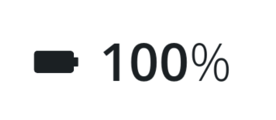

# Channel Value

The `<ChannelValue>` component is used to display a channel value (and units). This component abstracts the styles used to display the channel and units as well as an optional inline icon. These are used as part of the [Hero](./Hero.md) component, but can also be used inline (e.g., in a list)



## Usage

```tsx
import { ChannelValue } from '@brightlayer-ui/react-native-components';

<ChannelValue value={100} units={'%'} icon={{ family: 'brightlayer-ui', name: 'battery' }} />;
```

## API

<div style="overflow: auto">

| Prop Name   | Description                                         | Type                             | Required | Default                  |
| ----------- | --------------------------------------------------- | -------------------------------- | -------- | ------------------------ |
| value       | Text to display for the value                       | `string` \| `number`             | yes      |                          |
| icon        | A component to render for the icon                  | [`IconSource`](./Icons.md)       | no       |                          |
| iconSize    | The size to render the icon                         | `number`                         | no       | `fontSize`               |
| iconColor   | A component to render for the icon                  | `string`                         | no       | `theme.colors.onSurface` |
| units       | Text to display for the units                       | `string`                         | no       |                          |
| unitSpace\* | Whether to show a space between the value and units | `'show'` \| `'hide'` \| `'auto'` | no       | `'auto'`                 |
| prefix      | If true, shows units before the value               | `boolean`                        | no       | `false`                  |
| fontSize    | The size used for the text elements                 | `number`                         | no       | 'medium'                 |
| color       | The color used for the text elements                | `string`                         | no       | `theme.colors.onSurface` |
| theme       | Theme value overrides                               | `$DeepPartial<ExtendedTheme>`    | no       |                          |

</div>

Any other props will be provided to the root element ([**View**](https://reactnative.dev/docs/view)).

> \*Setting `unitSpace` to `'auto'` will show a space for all units except for '%', '℉', '°F', '℃', '°C', and '°'. When `prefix` is true, the space will be shown for all units except for '$'.

### Styles

You can override the internal styles used by Brightlayer UI by passing a `styles` prop. It supports the following keys:

| Name  | Description                         |
| ----- | ----------------------------------- |
| root  | Styles applied to the root element  |
| units | Styles applied to the units element |
| value | Styles applied to the value element |
