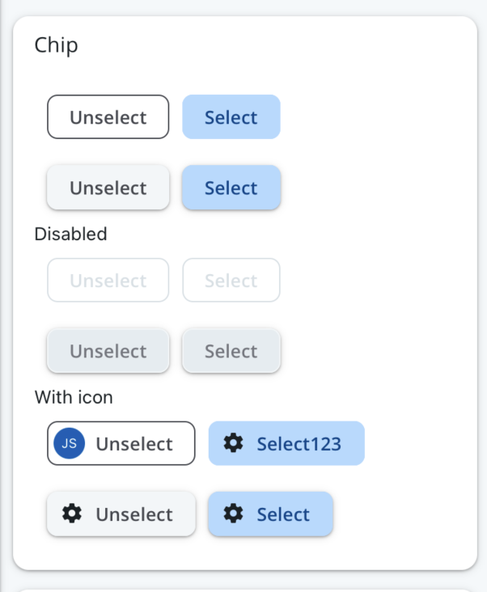

# Chip

The Chip component is a customizable [chip](https://callstack.github.io/react-native-paper/docs/components/Chip/)-based component that makes the chip component in alignment to BrightlayerUI. Chips are compact elements that can represent inputs, attributes, or actions. They can have an icon or avatar on the left, and a close button icon on the right.



## Usage

```tsx
import { Chip } from '@brightlayer-ui/react-native-components';

<Chip> Unselect </Chip>;
<Chip mode="elevated">Select</Chip>;
```

### Chip API

| Prop Name   | Description                        | Type                          | Required | Default |
| ----------- | ---------------------------------- | ----------------------------- | -------- | ------- |
| chipColor   | The color of the chip              | `string`                      | no       |         |
| textColor   | The color of the text label        | `string`                      | no       |         |
| iconColor   | The color of the icon              | `string`                      | no       |         |
| borderColor | The color of border color          | `string`                      | no       |         |
| icon        | A component to render for the icon | [`IconSource`](./Icons.md)    | no       |         |
| mode        | The size of the circle in px       | `string`                      | no       |         |
| avatar      | Avatar to display in chip          | `React.ReactNode`             | no       |         |
| theme       | Theme value overrides              | `$DeepPartial<ExtendedTheme>` | no       |         |

Other Props of chip can be found at [Chip Props](https://callstack.github.io/react-native-paper/docs/components/Chip/)

### Styles

You can override the internal styles used by Brightlayer UI by passing a `styles` prop. It supports the following keys:

| Name | Description                        |
| ---- | ---------------------------------- |
| root | Styles applied to the root element |
