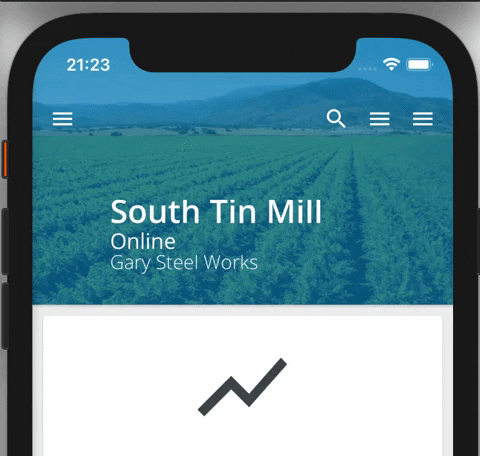

# CollapsibleHeaderLayout

The `<CollapsibleHeaderLayout>` component is used as a full-page layout component that manages the height of a collapsible [`<Header>`](./Header.md). When using the `dynamic` variant on the `<Header>`, it will gradually collapse and expand relative to the scroll position of the screen.



## Usage

```tsx
import { CollapsibleHeaderLayout } from '@brightlayer-ui/react-native-components';

<CollapsibleHeaderLayout
    HeaderProps={{
        variant: 'dynamic',
        title: 'Valley Forge',
        subtitle: 'The Last Stand',
        icon: { name: 'menu' },
        onIconPress: () => {},
        actionItems: [{ icon: MoreIcon, onPress: () => {} }],
    }}
>
    {/* Main content to go in the ScrollView */}
</CollapsibleHeaderLayout>;
```

> Note that you must set the `variant` prop to 'dynamic' in the `HeaderProps` object for the collapsible behavior to work.

## API

<div style="overflow: auto">

| Prop Name       | Description                                                                             | Type                                                                                                                    | Required | Default |
| --------------- | --------------------------------------------------------------------------------------- | ----------------------------------------------------------------------------------------------------------------------- | -------- | ------- |
| HeaderProps     | Props to spread to the underlying [Header](./Header.md)                                 | `HeaderProps`                                                                                                           | yes      |         |
| ScrollViewProps | Props to spread to the underlying [ScrollView](https://reactnative.dev/docs/scrollview) | [`ScrollViewProps`](https://reactnative.dev/docs/scrollview#props)                                                      | no       |         |
| theme           | Theme value overrides                                                                   | `$DeepPartial<ExtendedTheme>`                                                                                           | no       |         |
| ScrollComponent | A Custom Scroll container to render inside the `CollapsibleHeaderLayout`                | (handleScroll: (e: any) => void, contentPadding: Animated.Value,contentOffset: { x: number; y: number;}) => JSX.Element | no       |         |

</div>

Any other props will be provided to the root element ([**View**](https://reactnative.dev/docs/view)).

### Styles

You can override the internal styles used by Brightlayer UI by passing a `styles` prop. It supports the following keys:

| Name | Description                        |
| ---- | ---------------------------------- |
| root | Styles applied to the root element |

### Using a Custom Scroll Component

Components other than `ScrollView` must be passed as a `ScrollComponent` prop to the `<CollapsibleHeaderLayout>` component. The `ScrollComponent` prop accepts a `handleScroll` function, as well as `contentPadding` and `contentOffset` arguments and returns a JSX.Element. The `<CollapsibleHeaderLayout>` component handles the necessary scroll calculations by calling the handleScroll method within the `onScroll` event. This is demonstrated in detail in the examples section.

```ts
ScrollComponent?: (handleScroll: (e: any) => void,
                   contentPadding: Animated.Value,
                   contentOffset: { x: number; y: number;}) => JSX.Element
```

#### FlatList as a ScrollComponent Example

```tsx
<CollapsibleHeaderLayout
    HeaderProps={{
        expandedHeight: EXPANDED_HEADER_HEIGHT,
        collapsedHeight: COLLAPSED_HEADER_HEIGHT,
        expandable: true,
        startExpanded: true,
        variant: 'dynamic',
        title: 'Valley Forge One',
        style: { opacity: 0.5, flex: 1 },
    }}
    ScrollComponent={(
        handleScroll: (e: any) => void,
        contentPadding: Animated.Value,
        contentOffset: { x: number; y: number }
    ): any => (
        <Animated.FlatList
            testID={'blui-scrollview'}
            scrollEventThrottle={32}
            contentContainerStyle={{
                // You must convert the contentPadding Animated.value to a number before using it in the context of contentContainerStyles since the container is not Animated
                // If this is omitted you will be unable to scroll to the bottom of the FlatList
                paddingTop: parseInt(JSON.stringify(contentPadding)),

                // Additional padding added to the bottom of the contentContainer
                paddingBottom: 24,
            }}
            // Be sure to pass contentOffset here
            contentOffset={contentOffset}
            data={[
                {
                    id: '1',
                    title: 'Item 1',
                },
                {
                    id: '2',
                    title: 'Item 2',
                },
                //...
            ]}
            renderItem={({ item }): any => (
                <View>
                    <Text>{item.title}</Text>
                </View>
            )}
            keyExtractor={(item: any): any => item.id}
            // Be sure to call the handleScroll method here to update the view on scroll
            onScroll={(e: any): any => handleScroll(e)}
        />
    )}
/>
```

#### SectionList as a ScrollComponent Example

```tsx
<CollapsibleHeaderLayout
    HeaderProps={{
        expandedHeight: EXPANDED_HEADER_HEIGHT,
        collapsedHeight: COLLAPSED_HEADER_HEIGHT,
        expandable: true,
        startExpanded: true,
        variant: 'dynamic',
        title: 'Valley Forge One',
        style: { opacity: 0.5, flex: 1 },
    }}
    ScrollComponent={(
        handleScroll: (e: any) => void,
        contentPadding: Animated.Value,
        contentOffset: { x: number; y: number }
    ): any => (
        <SectionList
            testID={'blui-scrollview'}
            scrollEventThrottle={32}
            contentContainerStyle={{
                // You must convert the contentPadding Animated.value to a number before using it in the context of contentContainerStyles since the container is not Animated
                // If this is omitted you will be unable to scroll to the bottom of the FlatList
                paddingTop: parseInt(JSON.stringify(contentPadding)),

                // Additional padding added to the bottom of the contentContainer
                paddingBottom: 24,
            }}
            contentOffset={contentOffset}
            sections={[
                {
                    id: '1',
                    title: 'Title 1',
                    data: ['Item 1', 'Item 2', 'Item 3'],
                },
                {
                    id: '2',
                    title: 'Title 2',
                    data: ['Item 4', 'Item 5', 'Item 6'],
                },
                //...
            ]}
            renderItem={({ item }: any): any => (
                <View style={styles.item}>
                    <Text>{item}</Text>
                </View>
            )}
            keyExtractor={(item: any, index): any => index}
            // Be sure to call the handleScroll method here to update the view on scroll
            onScroll={(e: any): any => handleScroll(e)}
            renderSectionHeader={({ section: { title } }: any): JSX.Element => <Text>{title}</Text>}
        />
    )}
/>
```
