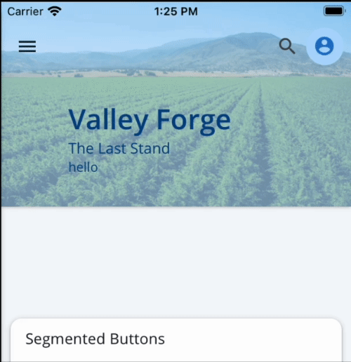

# CollapsibleHeaderLayout

The `<CollapsibleHeaderLayout>` component is used as a full-page layout component that manages the height of a collapsible [`<Header>`](./Header.md). When using the `dynamic` variant on the `<Header>`, it will gradually collapse and expand relative to the scroll position of the screen.



## Usage

```tsx
import { CollapsibleHeaderLayout } from '@pxblue/react-native-components';
import Icon from 'react-native-vector-icons/MaterialIcons';
const MenuIcon = wrapIcon({IconClass: Icon, name:'menu'});
...
<CollapsibleHeaderLayout
    HeaderProps={
        title=: 'Valley Forge',
        subtitle: 'The Last Stand',
        navigation: {icon: MenuIcon, onPress: () => {}},
        actionItems: [
            {icon: MoreIcon, onPress: () => {}}
        ]
    }
>
    {/* Main content to go in the ScrollView */ }
</CollapsibleHeaderLayout>
```

## API

<div style="overflow: auto">

| Prop Name       | Description                                             | Type                                                               | Required | Default |
| --------------- | ------------------------------------------------------- | ------------------------------------------------------------------ | -------- | ------- |
| HeaderProps     | Props to spread to the underlying [Header](./Header.md) | `HeaderProps`                                                      | yes      |         |
| ScrollViewProps | Props to spread to the underlying ScrollView            | [`ScrollViewProps`](https://reactnative.dev/docs/scrollview#props) | no       |         |
| styles          | Style overrides                                         | `Object`                                                           | no       |         |
| theme           | Theme partial for default styling                       | `Theme`                                                            | no       |         |

</div>

Any other props will be provided to the root element ([**View**](https://reactnative.dev/docs/view)).

### Styles

You can override the internal styles used by PX Blue by passing a `styles` prop. It supports the following keys:

| Name | Description                        |
| ---- | ---------------------------------- |
| root | Styles applied to the root element |
