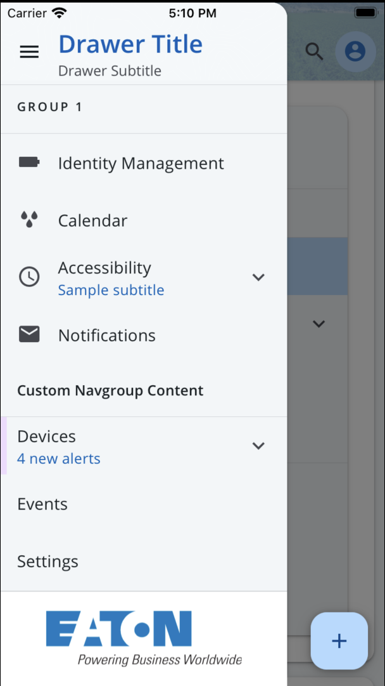

# Drawer

The `<Drawer>` component is side-menu that houses navigation items. The Brightlayer UI Drawer includes helper components for `<DrawerHeader>`, `<DrawerSubheader>`, `<DrawerBody>`, `<DrawerNavGroup>`, `<DrawerNavItem>`, and `<DrawerFooter>`to help organize the content. To integrate in-app navigation, the `<Drawer>` component needs to be paired with a navigation provider — we recommend using [React Navigation](https://reactnavigation.org/docs/getting-started).

To learn more about the Navigation design pattern, check out our [documentation](https://brightlayer-ui.github.io/patterns/navigation).

## Drawer

The `<Drawer>` component is the parent container, which manages the overall state of the drawer and renders the child components.

<br/>

### Drawer Usage

```tsx
import {
    Drawer,
    DrawerHeader,
    DrawerBody,
    DrawerNavGroup,
    DrawerNavItem,
} from '@brightlayer-ui/react-native-components';

<Drawer
    activeItem={selectedItem}
    onItemSelect={(id) => {
        /* updateSelectedItem */
    }}
>
    <DrawerHeader title={'Drawer Title'} subtitle={'Drawer Subtitle'} icon={<Menu />} />
    <DrawerSubheader>{/* contents */}</DrawerSubheader>
    <DrawerBody>
        {/* Using 'items' prop */}
        <DrawerNavGroup
            title={'Navigation Group'}
            items={[
                {
                    title: 'Identity Management',
                    itemID: 'g1i1',
                },
            ]}
        />
        {/* Using children */}
        <DrawerNavGroup title={'Navigation Group'}>
            <DrawerNavItem itemID={'item1'} title={'Item 1'} />
            <DrawerNavItem itemID={'item2'} title={'Item 2'}>
                <DrawerNavItem itemID={'item3'} title={'Item 3'} />
            </DrawerNavItem>
        </DrawerNavGroup>
    </DrawerBody>
    <DrawerFooter>{/* contents */}</DrawerFooter>
</Drawer>;
```

### Drawer API

<div style="overflow: auto;">

| Prop Name                       | Description                                                          | Type                   | Required | Default |
| ------------------------------- | -------------------------------------------------------------------- | ---------------------- | -------- | ------- |
| activeItem                      | The itemID of the currently active / selected item                   | `string`               | no       |         |
| onItemSelect                    | A callback function to execute whenever a navigation item is clicked | `(id: string) => void` | no       |         |
| [...sharedProps](#shared-props) | Props that can be set at any level in the drawer hierarchy           | -                      | -        |         |

</div>

Any other props will be provided to the root element ([**View**](https://reactnative.dev/docs/view)).

#### Styles

You can override the internal styles used by Brightlayer UI by passing a `styles` prop. The Drawer supports the following keys:

<div style="overflow: auto;">

| Name | Description                                 |
| ---- | ------------------------------------------- |
| root | Style override for the root Surface element |

</div>

## DrawerHeader

The `<DrawerHeader>` is a subsection that appears at the top of `<Drawer>`. Its content can be provided by the `title`, `subtitle`, and `icon` props, or you can pass in your own custom content via `titleContent`.

### DrawerHeader API

<div style="overflow: auto">

| Prop Name         | Description                                      | Type                          | Required | Default                |
| ----------------- | ------------------------------------------------ | ----------------------------- | -------- | ---------------------- |
| backgroundColor   | The color used for the background                | `string`                      | no       | `theme.colors.surface` |
| backgroundImage   | An image to display in the header                | `ImageSourcePropType`         | no       |                        |
| backgroundOpacity | The opacity of the background image              | `number`                      | no       | `0.3`                  |
| fontColor         | Color of the icon and header texts               | `string`                      | no       | Multiple               |
| icon              | A component to render for the icon               | [`IconSource`](./Icons.md)    | no       |                        |
| onPress           | A callback to execute when the header is pressed | `() => void`                  | no       |                        |
| onIconPress       | A callback to execute when the icon is pressed   | `() => void`                  | no       |                        |
| subtitle          | The second line of text                          | `string`                      | no       |                        |
| title             | The first line of text                           | `string`                      | no       |                        |
| titleContent      | Custom content for header title area             | `ReactNode`                   | no       |                        |
| theme             | Theme value overrides                            | `$DeepPartial<ExtendedTheme>` | no       |                        |

</div>

Any other props will be provided to the root element ([**View**](https://reactnative.dev/docs/view)).

### Styles

You can override the internal styles used by Brightlayer UI by passing a `styles` prop. The DrawerHeader supports the following keys:

<div style="overflow: auto">

| Name                   | Description                                    |
| ---------------------- | ---------------------------------------------- |
| root                   | Styles applied to the root element             |
| backgroundImageWrapper | Styles applied to the background image wrapper |
| backgroundImage        | Styles applied to the background image         |
| content                | Styles applied to the content wrapper          |
| textContent            | Styles applied to the text wrapper             |
| title                  | Styles applied to the title element            |
| subtitle               | Styles applied to the subtitle element         |
| icon                   | Styles applied to the left icon element        |

</div>

## DrawerSubheader

The `<DrawerSubheader>` is an optional subsection that will appear below the `<DrawerHeader>` and above the `<DrawerBody>`. It can be used to support custom content (passed as children), such as filtering options or to display additional information.

### DrawerSubheader API

<div style="overflow: auto;">

| Prop Name | Description                                          | Type      | Required | Default |
| --------- | ---------------------------------------------------- | --------- | -------- | ------- |
| divider   | Whether to show a dividing line below the HeroBanner | `boolean` | no       | `true`  |

</div>

## DrawerBody

The `<DrawerBody>` is a wrapper for the main content of the Drawer. The typical use case is to display `<DrawerNavGroup>` elements, but custom elements (e.g., for spacing) are accepted as well.

### DrawerBody API

<div style="overflow: auto;">

| Prop Name                       | Description                                                | Type               | Required | Default |
| ------------------------------- | ---------------------------------------------------------- | ------------------ | -------- | ------- |
| styles                          | Style overrides                                            | `DrawerBodyStyles` | no       |         |
| [...sharedProps](#shared-props) | Props that can be set at any level in the drawer hierarchy | -                  | -        |         |

</div>

Any other props will be provided to the root element ([**ScrollView**](https://reactnative.dev/docs/scrollview)).

#### Styles

You can override the internal styles used by Brightlayer UI by passing a `styles` prop. The Drawer supports the following keys:

<div style="overflow: auto;">

| Name | Description                                    |
| ---- | ---------------------------------------------- |
| root | Style override for the root ScrollView element |

</div>

## DrawerNavGroup

A `<DrawerNavGroup>` is used inside of the `<DrawerBody>` to organize links/content. Each group consists of an (optional) group title and a series of navigation items. Most visual props are inherited from the `<DrawerBody>` but can be overridden at the NavGroup level if desired.

The `items` property supports nested items to generate collapsible sections in the menu. This can be used to create an arbitrary tree depth, but we do not recommend going more than two levels deep in a navigation Drawer. You can also build the navigation links declaratively by passing `<DrawerNavItem>` children to the `<DrawerNavGroup>`.

### DrawerNavGroup API

<div style="overflow: auto;">

| Prop Name                       | Description                                                | Type        | Required | Default                  |
| ------------------------------- | ---------------------------------------------------------- | ----------- | -------- | ------------------------ |
| items                           | List of navigation items to render                         | `NavItem[]` | yes      |                          |
| title                           | Text to display in the group header                        | `string`    | no       |                          |
| titleColor                      | Color used for the title text                              | `string`    | no       | `theme.colors.onSurface` |
| titleContent                    | Custom element, substitute for title                       | `ReactNode` | no       |                          |
| titleDivider                    | Whether to show a divider below the title                  | `boolean`   | no       | true                     |
| [...sharedProps](#shared-props) | Props that can be set at any level in the drawer hierarchy | -           | -        |                          |

</div>

Any other props will be provided to the root element ([**View**](https://reactnative.dev/docs/view)).

#### Styles

You can override the internal styles used by Brightlayer UI by passing a `styles` prop. The DrawerNavGroup supports the following keys:

<div style="overflow: auto;">

| Name        | Description                            |
| ----------- | -------------------------------------- |
| root        | Styles applied to the root element     |
| textContent | Styles applied to the text wrapper     |
| title       | Styles applied to the title element    |
| divider     | Styles applied to the divider elements |

</div>

## DrawerFooter

The `<DrawerFooter>` is an optional section that renders at the bottom of the `<Drawer>`. It can be used to add any custom content (as children).

### DrawerFooter API

<div style="overflow: auto;">

| Prop Name | Description                                  | Type      | Required | Default |
| --------- | -------------------------------------------- | --------- | -------- | ------- |
| divider   | Whether to show a dividing line above footer | `boolean` | no       | `true`  |

</div>

## DrawerNavItem

The `<DrawerNavItem>` is an individual line item in the `<Drawer>`. These can be generated for you by using the `items` prop of the `<DrawerNavGroup>` and passing in an array of objects with the following API. You can also create these line items by directly passing them as children to the `<DrawerNavGroup>`. Each `<DrawerNavItem>` also supports the ability to nest items (using its own `items` prop or children).

### Drawer Nav Item API

<div style="overflow: auto;">

| Prop Name                       | Description                                                                                     | Type                       | Required | Default |
| ------------------------------- | ----------------------------------------------------------------------------------------------- | -------------------------- | -------- | ------- |
| depth\*                         | The nested depth of the item                                                                    | `number`                   | no       | 0       |
| hidden                          | Hide / do not render the nav item                                                               | `boolean`                  | no       | `false` |
| icon                            | A component to render for the left icon                                                         | [`IconSource`](./Icons.md) | no       |         |
| isInActiveTree\*                | Sets whether the item is a parent of the currently active item                                  | `boolean`                  | no       | `false` |
| itemID                          | An unique identifier of the NavItem. Item will have 'active' style when this matches activeItem | `string`                   | yes      |         |
| items                           | The items nested under this item                                                                | `NestedNavItem[]`          | no       |         |
| notifyActiveParent\*            | Callback function to the parent element to update active hierarchy styles                       | `(ids: string[]) => void`  | no       |         |
| onPress                         | A function to execute when the item is pressed                                                  | `() => void`               | no       |         |
| rightComponent                  | Custom content/component to display to the right                                                | `ReactNode`                | no       |         |
| statusColor                     | Color used for the status stripe and icon                                                       | `string`                   | no       |         |
| subtitle                        | The text to show on the second line                                                             | `string`                   | no       |         |
| title                           | The text to show on the first line                                                              | `string`                   | yes      |         |
| [...sharedProps](#shared-props) | Props that can be set at any level in the drawer hierarchy                                      | -                          | -        |         |

</div>

> Props marked with a star (\*) are managed automatically when using the `<DrawerNavItem>` inside of a `<DrawerNavGroup>`.

A `<NestedNavItem>` has all the same properties as a `<NavItem>` but does not support icons.

#### Styles

You can override the internal styles used by Brightlayer UI by passing a `styles` prop. The DrawerNavItem supports the following keys:

<div style="overflow: auto;">
    
| Name                     | Description                                         |
| ------------------------ | --------------------------------------------------- |
| root                     | Styles applied to the root element                  |
| activeBackground         | Styles applied to the background of an active item  |
| expandIcon               | Styles applied to right content expand icon         |
| infoListItem             | Styles passed to the underlying InfoListItem        |

</div>

## Shared Props

The following props can be set at any level in the drawer hierarchy (`<Drawer>`, `<DrawerBody>`, `<DrawerNavGroup>`, or `<DrawerNavItem>`). If they are set on a parent, they will be used for all children. For more customization, you can set these props on individual children and they will override any value set on the parent.

<div style="overflow: auto;">

| Name                          | Description                                                                    | Type                          | Required | Default                                                                                           |
| ----------------------------- | ------------------------------------------------------------------------------ | ----------------------------- | -------- | ------------------------------------------------------------------------------------------------- |
| activeChevronColor            | chevron color for the active item                                              | `string`                      | no       | `theme.colors.onPrimaryContainer`                                                                 |
| activeItemBackgroundColor     | Background color for the active item                                           | `string`                      | no       | `theme.colors.primaryContainer`                                                                   |
| activeItemBackgroundShape     | Shape of the active item background highlight                                  | `'round'` \| `'square'`       | no       | `square`                                                                                          |
| activeItemFontColor           | Font color for the active item                                                 | `string`                      | no       | `theme.colors.onPrimaryContainer`                                                                 |
| activeItemIconColor           | Icon color for the active item                                                 | `string`                      | no       | `theme.colors.onPrimaryContainer`                                                                 |
| backgroundColor               | Color used for the background of the element                                   | `string`                      | no       |                                                                                                   |
| chevron                       | Add chevrons for all menu items                                                | `boolean`                     | no       | `false`                                                                                           |
| chevronColor                  | Color override for the chevron icon                                            | `string`                      | no       | `theme.colors.onSurfaceVariant`                                                                   |
| collapseIcon                  | Icon used to collapse a DrawerNavGroup                                         | `JSX.Element`                 | no       | `expandIcon` rotated 180 degrees                                                                  |
| disableActiveItemParentStyles | When true, disables the semi-bold text style on parent elements of active item | `boolean`                     | no       | `false`                                                                                           |
| divider                       | Show a dividing line between all items                                         | `boolean`                     | no       | `false`                                                                                           |
| expandIcon                    | Icon used to expand a DrawerNavGroup                                           | `JSX.Element`                 | no       | `<MatIcon name={'expand-more'}/>` at top-level, `<MatIcon name={'arrow-drop-down'} />` for nested |
| hidePadding                   | Hide the padding reserved for DrawerNavItem icons                              | `boolean`                     | no       | `true`                                                                                            |
| itemFontColor                 | The color used for the DrawerNavItem text                                      | `string`                      | no       | `theme.colors.tertiary`                                                                           |
| itemIconColor                 | The color used for the DrawerNavItem icon                                      | `string`                      | no       | `theme.colors.onSurfaceVariant`                                                                   |
| nestedBackgroundColor         | Background color for nested items                                              | `string`                      | no       | `theme.colors.surfaceContainer`                                                                   |
| nestedDivider                 | Show a dividing line between nested items                                      | `boolean`                     | no       | `false`                                                                                           |
| theme                         | Theme value overrides                                                          | `$DeepPartial<ExtendedTheme>` | no       |                                                                                                   |

</div>
