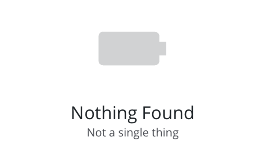

# Empty State

The `<EmptyState>` component is an element that can be used as a placeholder when no data is present (such as an empty list, or a placeholder page for future content). This is only used when no data is available, rather than during loading (see [empty states pattern](https://pxblue.github.io/patterns/empty-states)).



## Usage

```tsx
import { EmptyState } from '@pxblue/react-native-components';

<EmptyState title={'Nothing Found'} description={'Not a single thing'} icon={{ family: 'pxblue', name: 'battery' }} />;
```

## API

<div style="overflow: auto">

| Prop Name   | Description                                    | Type                                   | Required | Default |
| ----------- | ---------------------------------------------- | -------------------------------------- | -------- | ------- |
| title       | The primary text to display (first line)       | `string`                               | yes      |         |
| description | The secondary text to display (second line)    | `string`                               | no       |         |
| icon        | A component to render for the primary icon     | [`IconSource`](./Icons.md)             | no       |         |
| iconSize    | The size of the primary icon (100-200)         | `number`                               | no       | 100     |
| iconColor   | The color of the primary icon                  | `string`                               | no       | `text`  |
| actions     | Additional components to render below the text | `JSX.Element`                          | no       |         |
| theme       | Theme value overrides                          | `$DeepPartial<ReactNativePaper.Theme>` | no       |         |

</div>

### Styles

You can override the internal styles used by PX Blue by passing a `styles` prop. It supports the following keys:

| Name  | Description                         |
| ----- | ----------------------------------- |
| root  | Styles applied to the root element  |
| units | Styles applied to the units element |
| value | Styles applied to the value element |
