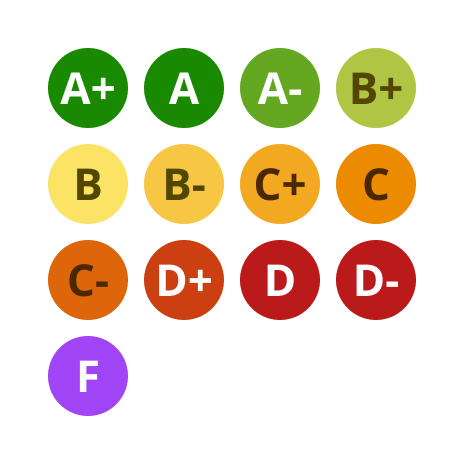

# Grade

The Grade component is a customizable [avatar](https://callstack.github.io/react-native-paper/4.0/avatar-text.html)-based component that represents different grades. It allows you to display a label with a specified background color and font color.


## Usage

```tsx
import { Grade } from '@brightlayer-ui/react-native-components';

<Grade label={'CS'} fontColor="#FFFFFF" backgroundColor="#198900" size={40} />;
```

### Grade API

| Prop Name       | Description                        | Type                          | Required | Default                  |
| --------------- | ---------------------------------- | ----------------------------- | -------- | ------------------------ |
| label           | The text shown in the circle       | `string`                      | yes      |                          |
| fontColor       | The color of the text label        | `string`                      | no       | `theme.colors.onPrimary` |
| backgroundColor | The background color of the circle | `string`                      | no       | `theme.colors.primary`   |
| size            | The size of the circle in px       | `number`                      | no       | 40                       |
| theme           | Theme value overrides              | `$DeepPartial<ExtendedTheme>` | no       |                          |

Any other props will be provided to the root element ([**View**](https://reactnative.dev/docs/view)).

## Grade Subcomponent

The subcomponents are a set of preconfigured components that can be used directly for specific grades with in-built styling.



### Grade Subcomponents Usage

```tsx
import Grade from '@brightlayer-ui/react-native-components';

<Grade.APlus /> {/* Renders A+ grade */}
<Grade.A /> {/* Renders A grade */}
<Grade.AMinus /> {/* Renders A- grade */}
<Grade.BPlus /> {/* Renders B+ grade */}
<Grade.B /> {/* Renders B grade */}
<Grade.BMinus /> {/* Renders B- grade */}
<Grade.CPlus /> {/* Renders C+ grade */}
<Grade.C /> {/* Renders C grade */}
<Grade.CMinus /> {/* Renders C- grade */}
<Grade.DPlus /> {/* Renders D+ grade */}
<Grade.D /> {/* Renders D grade */}
<Grade.DMinus /> {/* Renders D- grade */}
<Grade.F /> {/* Renders F grade */}
```

### Grade Subcomponents API

All Grade Subcomponents have the following Props

| Prop Name | Description         | Type     | Required | Default |
| --------- | ------------------- | -------- | -------- | ------- |
| size      | The radius of Grade | `number` | No       | 40      |

### Styles

You can override the internal styles used by Brightlayer UI by passing a `styles` prop. It supports the following keys:

| Name | Description                        |
| ---- | ---------------------------------- |
| root | Styles applied to the root element |
