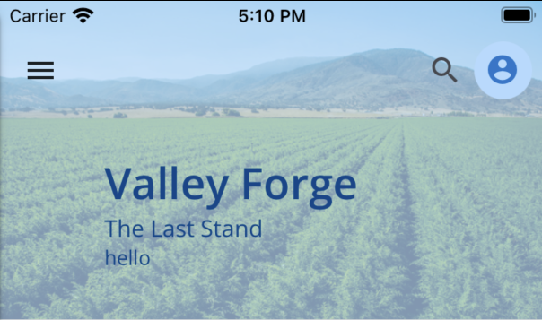

# Header

The `<Header>` component is used at the top of the page to display page information. It shows a title and has optional parameters to show a subtitle, background image, navigation button, and multiple action buttons. The header can also be configured to expand/collapse as desired. For expand/collapse behavior tied to the screen scroll position, you should use the [`<CollapsibleHeaderLayout>`](./CollapsibleHeaderLayout.md) component.




## Usage

```tsx
import { Header } from '@brightlayer-ui/react-native-components';

<Header
    title={'Valley Forge'}
    subtitle={'The Last Stand'}
    icon={{ name: 'menu' }}
    onIconPress={() => {}}
    actionItems={[
        {
            icon: { name: 'more-vert' },
            onPress: () => {},
        },
    ]}
/>;
```

## API

<div style="overflow: auto">

| Prop Name           | Description                                                                                                                | Type                                                                                | Required | Default                           |
| ------------------- | -------------------------------------------------------------------------------------------------------------------------- | ----------------------------------------------------------------------------------- | -------- | --------------------------------- |
| actionItems         | Array of icons / actions to display on the right                                                                           | `Array<HeaderIcon \| HeaderActionComponent>`                                        | no       |                                   |
| actionItemColor     | The color used for the action item icon                                                                                    | `string`                                                                            | no       | `theme.colors.onSurfaceVariant`   |
| backgroundColor     | The color used for the background                                                                                          | `string`                                                                            | no       | `theme.colors.primaryContainer`   |
| backgroundImage     | An image to blend with the colored background in the header                                                                | `ImageSourcePropType`                                                               | no       |                                   |
| collapsedHeight     | The height of the header when collapsed                                                                                    | `number`                                                                            | no       | 56                                |
| expandable          | Allow the header to expand/collapse on tap                                                                                 | `boolean`                                                                           | no       | `false`                           |
| expandedHeight      | The height of the header when expanded                                                                                     | `number`                                                                            | no       | 200                               |
| fontColor           | Color of the title, subtitle, info, and icons in the header                                                                | `string`                                                                            | no       | `theme.colors.onPrimaryContainer` |
| info                | Third line of text (hidden on collapse)                                                                                    | `ReactNode`                                                                         | no       |                                   |
| icon                | Icon to show to the left of the title                                                                                      | [`IconSource`](./Icons.md)                                                          | no       |                                   |
| navigationIconColor | The color used for the Navigation icon                                                                                     | `string`                                                                            | no       | `theme.colors.onSurface`          |
| onIconPress         | A callback to execute when the icon is pressed                                                                             | `() => void`                                                                        | no       |                                   |
| scrollPosition      | Y-value of the linked ScrollView (dynamic variant only)                                                                    | `Animated.Value`                                                                    | no       |                                   |
| searchableConfig    | Configuration object for search behavior                                                                                   | `SearchableConfig`                                                                  | no       |                                   |
| startExpanded       | Renders header in the expanded state to start                                                                              | `boolean`                                                                           | no       | `false`                           |
| subtitle            | The text to display on the second line                                                                                     | `ReactNode`                                                                         | no       |                                   |
| updateScrollView\*  | Callback function to update a linked ScrollView (dynamic variant only)                                                     | `({ padding: number \| null; animate: boolean; scrollTo: number \| null }) => void` | no       |                                   |
| title               | The text to display on the first line                                                                                      | `ReactNode`                                                                         | yes      |                                   |
| variant             | The resize mode of the Header (static will resize only on taps, if enabled. Dynamic will resize as the screen is scrolled) | `'dynamic'` \| `'static'`                                                           | no       | 'static'                          |
| theme               | Theme value overrides                                                                                                      | `$DeepPartial<ExtendedTheme>`                                                       | no       |                                   |

</div>

Any other props will be provided to the root element ([**View**](https://reactnative.dev/docs/view)).

> Props marked with a star (\*) are managed automatically when using the `<CollapsibleHeaderLayout>` component.

### Styles

You can override the internal styles used by Brightlayer UI by passing a `styles` prop. It supports the following keys:

| Name            | Description                                |
| --------------- | ------------------------------------------ |
| root            | Styles applied to the root element         |
| actionItem      | Styles applied to the action icon(s)       |
| actionPanel     | Styles applied to the actions container    |
| backgroundImage | Styles applied to the background image     |
| component       | Styles applied to the action components    |
| content         | Styles applied to the content wrapper      |
| info            | Styles applied to the info element         |
| icon            | Styles applied to the icon                 |
| search          | Styles applied to the search input element |
| subtitle        | Styles applied to the subtitle element     |
| textContent     | Styles applied to the text wrapper         |
| title           | Styles applied to the title element        |

# HeaderIcon

Header icons specified as a JSON object with the following properties:

<div style="overflow: auto">

| Key     | Description                        | Type                       | Required | Default |
| ------- | ---------------------------------- | -------------------------- | -------- | ------- |
| icon    | A component to render for the icon | [`IconSource`](./Icons.md) | yes      |         |
| onPress | A function to execute when pressed | `function`                 | no       |         |

</div>

# HeaderActionComponent

Header action components (e.g., avatar) are specified as a JSON object with the following properties:

<div style="overflow: auto">

| Key       | Description                          | Type          | Required | Default |
| --------- | ------------------------------------ | ------------- | -------- | ------- |
| component | A component to render for the avatar | `JSX.Element` | yes      |         |
| width     | The width of the component           | `number`      | no       | `40`    |

</div>

# SearchableConfig

SearchableConfig is an optional object used to configure the search functionality of the header component. It is a JSON object with the following properties:

<div style="overflow: auto">

| Key            | Description                                                    | Type                                                                 | Required | Default  |
| -------------- | -------------------------------------------------------------- | -------------------------------------------------------------------- | -------- | -------- |
| autoCapitalize | Determines how the search input will be capitalized            | [`TextInput.autoCapitalize`](https://reactnative.dev/docs/textinput) | no       | 'none'   |
| autoCorrect    | Determines whether auto-correct is enabled in the search input | `boolean`                                                            | no       | `false`  |
| autoFocus      | Gives focus to search input when opened                        | `boolean`                                                            | no       | `false`  |
| icon           | Icon to override default search icon                           | [`IconSource`](./Icons.md)                                           | no       |          |
| onChangeText   | Callback when search text changes                              | `(text: string) => void`                                             | no       |          |
| placeholder    | Placeholder text for the search input                          | `string`                                                             | no       | 'Search' |

</div>
