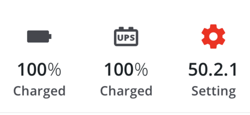

# Hero Components

Hero items are used to call attention to particular values.



## Hero

The `<Hero>` component displays a particular icon / icon-like component, value/units, and a label.

The value section of the Hero utilizes a [`<ChannelValue>`](./ChannelValue.md) component. To display a single simple value, the information can be passed as `ChannelValueProps`. For more complex values (such as a duration that displays hours and minutes), you can pass in `<ChannelValue>` components as children and they will be displayed inline.

### Hero Usage

```tsx
import { Hero } from '@brightlayer-ui/react-native-components';

<Hero
    label={'Charge'}
    icon={{ family: 'brightlayer-ui', name: 'battery' }}
    ChannelValueProps={{ value: 100, units: '%' }}
/>;
```

### Hero API

<div style="overflow: auto">

| Prop Name           | Description                                | Type                          | Required | Default                         |
| ------------------- | ------------------------------------------ | ----------------------------- | -------- | ------------------------------- |
| ChannelValueProps   | Props passed through to ChannelValue child | `ChannelValueProps`           | no       |                                 |
| icon                | A component to render for the primary icon | [`IconSource`](./Icons.md)    | yes      |                                 |
| iconBackgroundColor | The color behind the primary icon          | `string`                      | no       | transparent                     |
| iconColor           | The color of the primary icon              | `string`                      | no       | `theme.colors.onSurfaceVariant` |
| iconSize            | The size of the primary icon (10-48)       | `number`                      | no       | 36                              |
| label               | The text shown below the `ChannelValue`    | `string`                      | yes      |                                 |
| onPress             | A function to execute when pressed         | `function`                    | no       |                                 |
| theme               | Theme value overrides                      | `$DeepPartial<ExtendedTheme>` | no       |                                 |

</div>

Any other props will be provided to the root element ([**View**](https://reactnative.dev/docs/view)).

### Styles

You can override the internal styles used by Brightlayer UI by passing a `styles` prop. It supports the following keys:

| Name        | Description                                  |
| ----------- | -------------------------------------------- |
| root        | Styles applied to the root element           |
| iconWrapper | Styles applied to the icon wrapper element   |
| label       | Styles applied to the label element          |
| values      | Styles applied to the row of `ChannelValue`s |

## Hero Banner

The `<HeroBanner>` component is a simple wrapper component that is used to contain `<Hero>`s. It creates the flex container and sets up the spacing rules to display them. It accepts up to four `<Hero>` components by default as children. Any children after the `limit` will not be rendered.

### Hero Banner Usage

```tsx
import { Hero, HeroBanner } from '@brightlayer-ui/react-native-components';

<HeroBanner divider>
    <Hero label={'Hero One'} icon={{ family: 'brightlayer-ui', name: 'battery' }} />
    <Hero label={'Hero Two'} icon={{ family: 'brightlayer-ui', name: 'battery' }} />
    <Hero label={'Hero Three'} icon={{ family: 'brightlayer-ui', name: 'battery' }} />
    <Hero label={'Hero Four'} icon={{ family: 'brightlayer-ui', name: 'battery' }} />
</HeroBanner>;
```

### Hero Banner API

<div style="overflow: auto">

| Prop Name | Description                                         | Type      | Required | Default |
| --------- | --------------------------------------------------- | --------- | -------- | ------- |
| divider   | Whether to show a dividing line below the subheader | `boolean` | no       | `false` |

</div>

### Styles

You can override the internal styles used by Brightlayer UI by passing a `styles` prop. It supports the following keys:

| Name    | Description                           |
| ------- | ------------------------------------- |
| root    | Styles applied to the root element    |
| divider | Styles applied to the divider element |
