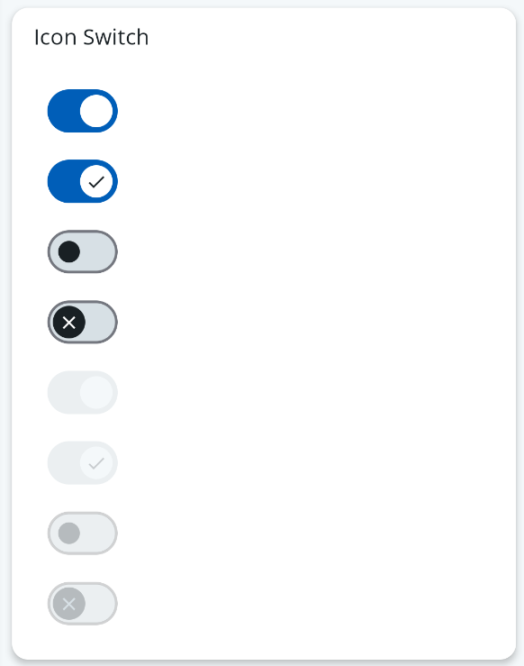

# Icon Switch

The `<IconSwitch />` is a switch component which renders a icon in switch's handle. We can use this component with icon rendered and without.



## Usage

```tsx
import { IconSwitch } from '@brightlayer-ui/react-native-components';

<IconSwitch />;

<IconSwitch showIcon />;
```

### API

<div style="overflow: auto;">

| Prop Name     | Description                      | Type                                   | Required | Default |
| ------------- | -------------------------------- | -------------------------------------- | -------- | ------- |
| showIcon      | To display icon or not           | `boolean`                              | no       |         |
| disabled      | Flag for render disabled switch  | `boolean`                              | no       |         |
| value         | Pass state to the component      | `boolean`                              | no       |         |
| onValueChange | Callback event handling function | `Function`                             | no       |         |
| theme         | Theme value overrides            | `$DeepPartial<ReactNativePaper.Theme>` | no       |         |

</div>

### Styles

You can override the internal style used by Brightlayer UI by passing a `style` prop.
