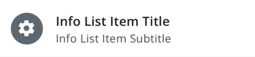

# Info List Item

The `<InfoListItem>` is intended to be used in List views. It positions a title as well as optional subtitle(s), icon, and status stripe.



## Usage

```tsx
<InfoListItem
    title={'Title'}
    icon={{ family: 'brightlayer-ui', name: 'leaf' }}
    subtitle={'A subtitle'}
    statusColor={BLUIColors.red[500]}
    backgroundColor={BLUIColors.blue[50]}
/>
```

### Advanced Usage

You can also supply an array of items that will be displayed as a character-separated subtitle. The separation character is configurable.

```tsx
<InfoListItem title={'Hillman Field East'} subtitle={['PXM 2000', 'DT 1150', '113.4 GPM']} subtitleSeparator={'/'} />
```

## API

<div style="overflow: auto">

| Prop Name         | Description                                                              | Type                                 | Required | Default                                                                                  |
| ----------------- | ------------------------------------------------------------------------ | ------------------------------------ | -------- | ---------------------------------------------------------------------------------------- |
| avatar            | Show a colored background behind icon                                    | `boolean`                            | no       | `false`                                                                                  |
| backgroundColor   | The color used for the background of the InfoListItem                    | `string`                             | no       | `transparent`                                                                            |
| chevron           | Add a chevron icon on the right                                          | `boolean`                            | no       | `false`                                                                                  |
| chevronColor      | The color used for chevron icon                                          | `string`                             | no       | `theme.colors.onSurfaceVariant`                                                          |
| dense             | Smaller height row with less padding                                     | `boolean`                            | no       | `false`                                                                                  |
| divider           | Show a dividing line below the row                                       | `'full'` \| `'partial'`              | no       |                                                                                          |
| fontColor         | Color to use for text elements                                           | `string`                             | no       | For title: `theme.colors.onSurface`, For subtitle, info: `theme.colors.onSurfaceVariant` |
| hidePadding       | Hide padding reserved for icons when there is no icon                    | `boolean`                            | no       | `false`                                                                                  |
| iconAlign         | Icon alignment when `avatar` is set to`false`                            | `'left'` \| `'center'` \| `'right'`  | no       | `left`                                                                                   |
| icon              | A component to render for the icon                                       | [`IconSource`](./Icons.md)           | no       |                                                                                          |
| iconColor         | Color to use for the icon                                                | `string`                             | no       | `theme.colors.onSurfaceVariant`, With Avatar: `theme.colors.onNeutralFilledContainer`    |
| info              | The text to show on the third line                                       | `string` \| `Array<React.ReactNode>` | no       |                                                                                          |
| leftComponent     | Custom content to render between the icon and the text elements          | `JSX.Element`                        | no       |                                                                                          |
| onPress           | A function to execute when pressed                                       | `function`                           | no       |                                                                                          |
| rightComponent    | Custom content to render to the right of the text elements               | `JSX.Element`                        | no       |                                                                                          |
| statusColor       | Color to use for status (affects status stripe and icon)                 | `string`                             | no       | `theme.colors.onSurfaceVariant`                                                          |
| subtitle          | The text to show on the second line                                      | `string` \| `Array<React.ReactNode>` | no       |                                                                                          |
| subtitleSeparator | Separator character for subtitle                                         | `string`                             | no       | '·' ('\u00B7')                                                                           |
| title             | The text to show on the first line                                       | `string`                             | yes      |                                                                                          |
| wrapInfo          | Whether the info line text should wrap to multiple lines on overflow     | `boolean`                            | no       | `false`                                                                                  |
| wrapSubtitle      | Whether the subtitle line text should wrap to multiple lines on overflow | `boolean`                            | no       | `false`                                                                                  |
| wrapTitle         | Whether the title line text should wrap to multiple lines on overflow    | `boolean`                            | no       | `false`                                                                                  |
| theme             | Theme value overrides                                                    | `$DeepPartial<ExtendedTheme>`        | no       |                                                                                          |

</div>

Any other props will be provided to the root element ([**View**](https://reactnative.dev/docs/view)).

### Styles

You can override the internal styles used by Brightlayer UI by passing a `styles` prop. It supports the following keys:

| Name            | Description                                     |
| --------------- | ----------------------------------------------- |
| root            | Styles applied to the root element              |
| statusStripe    | Styles applied to the status stripe element     |
| icon            | Styles applied to the icon element              |
| iconWrapper     | Styles applied to the icon wrapper              |
| infoWrapper     | Styles applied to the info wrapper              |
| info            | Styles applied to the info text elements        |
| avatar          | Styles applied to the avatar background         |
| mainContent     | Styles applied to the main text content wrapper |
| title           | Styles applied to the title element             |
| subtitleWrapper | Styles applied to the subtitle wrapper          |
| subtitle        | Styles applied to the subtitle text elements    |
| divider         | Styles applied to the divider element           |
