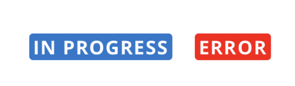

# List Item Tag

`<ListItemTag>` is a text item with a colored background and rounded corners that is used to tag lists.



In an [info list item](/info/components-documentation--info-list-item):


## Usage

```tsx
import { ListItemTag } from '@pxblue/react-native-components';

<ListItemTag label={'IN PROGRESS'} />
<ListItemTag label={'Foo Bar'} backgroundColor={'gold'} fontColor={'black'} />
```

## API

<div style="overflow: auto;">

| Prop Name       | Description                   | Type     | Required | Default                   |
| --------------- | ----------------------------- | -------- | -------- | ------------------------- |
| backgroundColor | Background color of the label | `string` | no       | `theme.colors.primary`    |
| fontColor       | Text color for the label      | `string` | no       | Varies based on the theme |
| label           | The label text                | `string` | yes      |                           |

</div>

Any other props will be provided to the root element [`<Overline>`](https://pxblue-components.github.io/react-native/?path=/info/components-documentation--typography).

### Styles

You can override the internal styles used by PX Blue by passing a `styles` prop. It supports the following key:

| Name | Description                        |
| ---- | ---------------------------------- |
| root | Styles applied to the root element |
