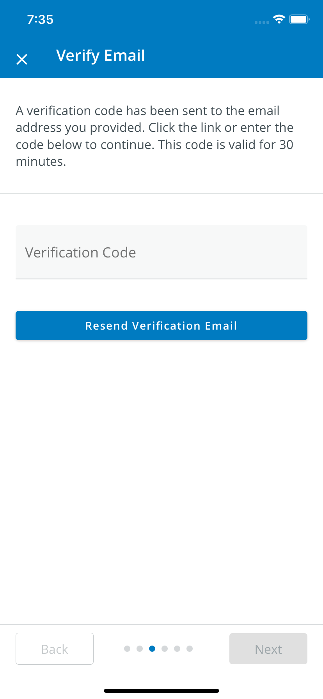

# Mobile Stepper

The `<MobileStepper>` is used to minimally display progress when completing a workflow that requires multiple steps.  There are three types of progress indicators supported, `dots` (default), `text`, and `progress`. 

<!-- @TODO: This image is of the login workflow example using the old stepper. Replace this image once this stepper is implemented in the workflow  -->


## Usage

```tsx
import { MobileStepper } from '@pxblue/react-native-components';

    <MobileStepper 
      activeStep={activeStep}
      steps={steps}
      leftButton={
        <View style={{ flex: 1 }}>
          <Button
            style={{ width: 100, alignSelf: 'flex-start' }}
            disabled={activeStep === 0}
            onPress={(): void => activeStep = activeStep - 1}
            mode="outlined"
          >Back</Button>
        </View>
      }
      rightButton={
        <View style={{ flex: 1 }}>
          <Button
            style={{ width: 100, alignSelf: 'flex-end' }}
            disabled={activeStep === steps - 1}
            onPress={(): void => activeStep = activeStep + 1}
            mode="contained"
          >Next</Button>
        </View>
      }
      variant={'dots'}>
    </MobileStepper>
```

## API

<div style="overflow: auto;">

| Prop Name       | Description                    | Type                     | Required | Default | 
| --------------- | ------------------------------ | ------------------------ | -------- | ------- |
| activeStep      | The index of the active step   | `number`                 | yes      |         |
| leftButton      | Left button content            | `JSX.Element`            | no       |         |
| rightButton     | Right button content           | `JSX.Element`            | no       |         |
| steps           | How many steps to display      | `number`                 | yes      |         |
| variant         | Which type of indicator to use | `dots | text | progress` | no       | `dots`  |
      
</div>

<!-- @TODO: Which styles should be customizable? -->
### Styles

You can override the internal styles used by PX Blue by passing a `styles` prop. It supports the following key:

| Name | Description                        |
| ---- | ---------------------------------- |
| root | Styles applied to the root element |
