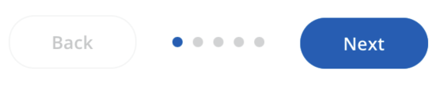
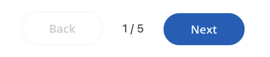
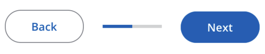

# Mobile Stepper

The `<MobileStepper>` is used to minimally display progress when completing a workflow that requires multiple steps. There are three types of progress indicators supported, `dots` (default), `text`, and `progress`.

In Dot Variant:



In Text Variant:



In Progress Variant:



## Usage

```tsx
import { MobileStepper } from '@brightlayer-ui/react-native-components';

<MobileStepper
    activeStep={activeStep}
    steps={steps}
    leftButton={<BackButton />}
    rightButton={<NextButton />}
    variant={'dots'}
/>;
```

## API

<div style="overflow: auto;">

| Prop Name     | Description                                    | Type                                 | Required | Default                 |
| ------------- | ---------------------------------------------- | ------------------------------------ | -------- | ----------------------- |
| activeColor   | Color of the active page indicator             | `string`                             | no       | `theme.colors.primary`  |
| activeStep    | The index of the active step (>= 0)            | `number`                             | yes      |                         |
| inactiveColor | Color of inactive dot when using 'dot' variant | `string`                             | no       | `theme.colors.disabled` |
| leftButton    | Left button content                            | `JSX.Element`                        | no       |                         |
| rightButton   | Right button content                           | `JSX.Element`                        | no       |                         |
| steps         | Total number of steps to display (>0)          | `number`                             | yes      |                         |
| variant       | Which type of indicator to use                 | `'dots'` \| `'text'` \| `'progress'` | no       | `dots`                  |
| theme         | Theme value overrides                          | `$DeepPartial<ExtendedTheme>`        | no       |                         |

</div>

Any other props will be provided to the root element ([**View**](https://reactnative.dev/docs/view)).

### Styles

You can override the internal styles used by Brightlayer UI by passing a `styles` prop. It supports the following key:

| Name             | Description                                                      |
| ---------------- | ---------------------------------------------------------------- |
| root             | Styles applied to the root element                               |
| circle           | Styles applied to dots when using 'dot' variant                  |
| filled           | Styles applied to active dot when using 'dot' variant            |
| stepperContainer | Styles applied to stepper container                              |
| progressBar      | Styles applied to the progress bar when using 'progress' variant |
| text             | Styles applied to the text when using 'text' variant             |
