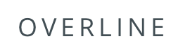

# Overline

Overline component is used to render text on the screen.



## Usage

```tsx
import { Overline } from '@brightlayer-ui/react-native-components';

<View>
    <Overline>Overline</Overline>
</View>;
```

## API

<div style="overflow: auto">

| Prop Name | Description           | Type                          | Required | Default |
| --------- | --------------------- | ----------------------------- | -------- | ------- |
| theme     | Theme value overrides | `$DeepPartial<ExtendedTheme>` | no       |         |

</div>

Any other props will be provided to the root element [`<Text>`](https://callstack.github.io/react-native-paper/docs/components/Text).

### Styles

You can override the internal styles used by Brightlayer UI by passing a `styles` prop. It supports the following keys:

| Name | Description                        |
| ---- | ---------------------------------- |
| root | Styles applied to the root element |
