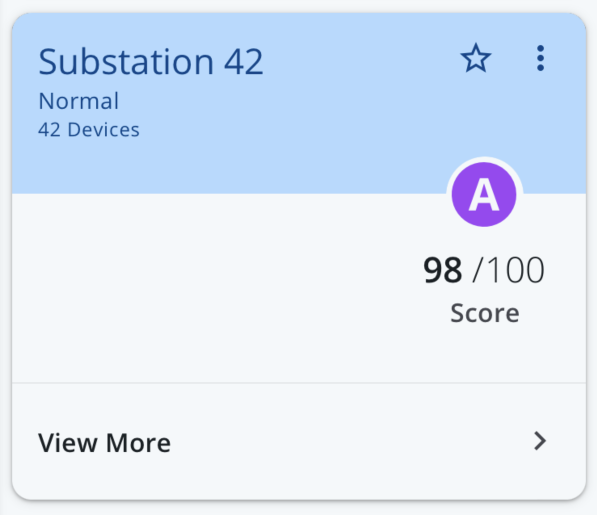
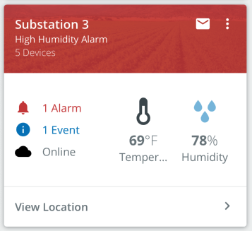

# Score Card

Card component that calls attention to particular values.

<br/>


## Usage

```tsx
import { Hero, HeroBanner, InfoListItem, Body, ScoreCard, wrapIcon } from '@pxblue/react-native-components';
import MatIcon from 'react-native-vector-icons/MaterialIcons';
import _A from '@pxblue/icons-svg/grade_a.svg';
const A = wrapIcon({ IconClass: _A });
const MoreIcon = wrapIcon({ IconClass: MatIcon, name: 'more-vert' });
...
<ScoreCard
    headerTitle={'Portland Datacenter Long Name'}
    headerSubtitle={'6 UPS Devices'}
    actionItems={[
        { icon: MoreIcon, onPress: () => { } }
    ]}
    badgeOffset={-55}
    badge={
        <HeroBanner style={{ flex: 0, minWidth: 80, justifyContent: 'flex-end' }}>
            <Hero
                label={'Score'}
                iconSize={48}
                iconColor={PXBColors.green[500]}
                value={98}
                units={'/100'}
                IconClass={A}
            />
        </HeroBanner>
    }
    actionRow={
        <InfoListItem chevron title={'View More'} onPress={() => { }} />
    }
>
    {/* Body Content */}
</ScoreCard>
```

## API

<div style="overflow: auto">

| Prop Name             | Description                                 | Type                  | Required | Default                  |
| --------------------- | ------------------------------------------- | --------------------- | -------- | ------------------------ |
| headerTitle           | The primary text                            | `string`              | yes      |                          |
| headerSubtitle        | The secondary text                          | `string`              | no       |                          |
| headerInfo            | Tertiary text (hidden on collapse)          | `string`              | no       |                          |
| headerColor           | The color of the header                     | `string`              | no       | `theme.colors.primary`   |
| headerFontColor       | The color for text and icons in header      | `string`              | no       | `theme.colors.onPrimary` |
| headerBackgroundImage | An image to display in the header           | `ImageSourcePropType` | no       |                          |
| actionItems           | Icons to show to the right of the text      | `HeaderIcon[]`        | no       |                          |
| badge                 | The component to render in the callout area | `React.Component`     | no       |                          |
| badgeOffset           | Vertical offset for the badge component     | `number`              | no       |                          |
| actionRow             | Component to render for the footer          | `React.Component`     | no       |                          |
| theme                 | Theme partial for default styling           | `Theme`               | no       |                          |

</div>

### Styles

You can override the internal styles used by PX Blue by passing a `styles` prop. It supports the following keys:

| Name              | Description                                    |
| ----------------- | ---------------------------------------------- |
| root              | Styles applied to the root card element        |
| header            | Styles applied to the card header element      |
| backgroundImage   | Styles applied to the background image wrapper |
| headerContent     | Styles applied to the header content wrapper   |
| headerText        | Styles applied to the header text wrapper      |
| title             | Styles applied to the title element            |
| subtitle          | Styles applied to the subtitle element         |
| info              | Styles applied to the info element             |
| headerActions     | Styles applied to the header actions wrapper   |
| headerActionItem  | Styles applied to the header action icons      |
| body              | Styles applied to the card body element        |
| leftContent       | Styles applied to the {children} wrapper       |
| badge             | Styles applied to the badge wrapper            |
| actionRow         | Styles applied to the action row element       |

# Header Icon

Header icons specified as a JSON object with the following properties:

<div style="overflow: auto">

| Key     | Description                        | Type                                               | Required | Default |
| ------- | ---------------------------------- | -------------------------------------------------- | -------- | ------- |
| icon    | A component to render for the icon | `React.Component<{ size: number, color: string }>` | yes      |         |
| onPress | A function to execute when clicked | `function`                                         | yes      |         |

</div>