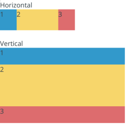

# Spacer

An invisible utility component that acts as a spacer element in various layouts. It works with flexbox sizing or fixed sizing.

<div style="width: 100%; text-align:center">
    <br/>
</div>

## Usage

```tsx
import { Spacer } from '@brightlayer-ui/react-native-components';

<View style={{ display: 'flex' }}>
    {/* Left Content */}
    <Spacer />
    {/* Right Content */}
</View>;
```

> Using flex elements (like Spacer) inside of a [ScrollView](https://reactnative.dev/docs/scrollview) will not have an effect unless the parent has a fixed height.

## API

<div style="overflow: auto;">

| Prop Name | Description                                    | Type     | Required | Default |
| --------- | ---------------------------------------------- | -------- | -------- | ------- |
| flex      | Flex grow/shrink value for use in flex layouts | `number` | no       | 1       |
| height    | Height (in dp) for static layouts              | `number` | no       |         |
| width     | Width (in dp) for static layouts               | `number` | no       |         |

</div>

Any other props will be provided to the root element ([**View**](https://reactnative.dev/docs/view)).

### Styles

You can override the classes used by Brightlayer UI by passing a `styles` prop. It supports the following key:

| Name | Description                        |
| ---- | ---------------------------------- |
| root | Styles applied to the root element |
