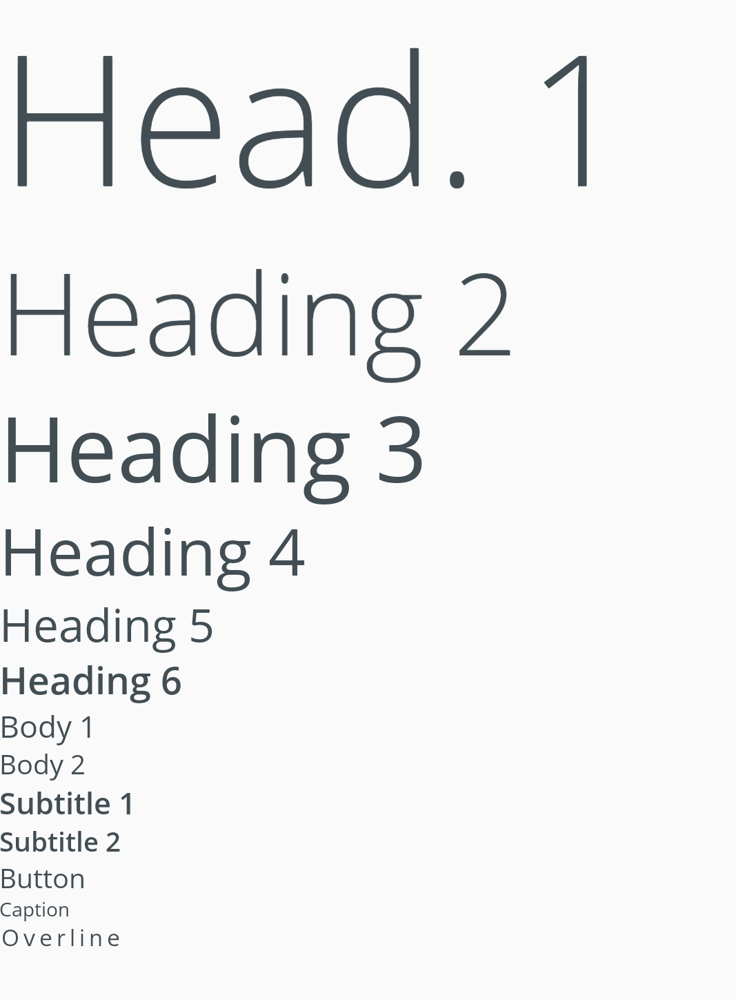

# Typography

Typography components are used to render text on the screen. This library provides several helper components that automatically apply various styles from the theme to avoid repeated custom styling throughout an application.



We provide components for: `<H1>`, `<H2>`, `<H3>`, `<H4>`, `<H5>`, `<H6>`, `<Body1>`, `<Body2>`, `<Subtitle1>`, `<Subtitle2>`, `<Button>`, `<Caption>`, `<Overline>`

## Usage

```tsx
import * as Typography from '@pxblue/react-native-components';
...
<View>
    <Typography.H1>Head. 1</Typography.H1>
    <Typography.H2>Heading 2</Typography.H2>
    <Typography.H3>Heading 3</Typography.H3>
    <Typography.H4>Heading 4</Typography.H4>
    <Typography.H5>Heading 5</Typography.H5>
    <Typography.H6>Heading 6</Typography.H6>
    <Typography.Body1>Body 1</Typography.Body1>
    <Typography.Body2>Body 2</Typography.Body2>
    <Typography.Subtitle1>Subtitle 1</Typography.Subtitle1>
    <Typography.Subtitle2>Subtitle 2</Typography.Subtitle2>
    <Typography.Button>Button</Typography.Button>
    <Typography.Caption>Caption</Typography.Caption>
    <Typography.Overline>Overline</Typography.Overline>
</View>
```

## API

All typography components in this library share a common API.

<div style="overflow: auto">

| Prop Name | Description                     | Type                                                                                | Required | Default |
| --------- | ------------------------------- | ----------------------------------------------------------------------------------- | -------- | ------- |
| font      | The font style (from the theme) | keyof [`theme.fonts`](https://callstack.github.io/react-native-paper/theming.html)  | no       |         |
| fontSize  | The font size                   | `number`                                                                            | no       |         |
| color     | The font color (from the theme) | keyof [`theme.colors`](https://callstack.github.io/react-native-paper/theming.html) | no       | 'text'  |
| theme     | Theme value overrides           | `$DeepPartial<ReactNativePaper.Theme>`                                              | no       |         |

</div>

### Styles

You can override the internal styles used by PX Blue by passing a `styles` prop. It supports the following keys:

| Name | Description                        |
| ---- | ---------------------------------- |
| root | Styles applied to the root element |
