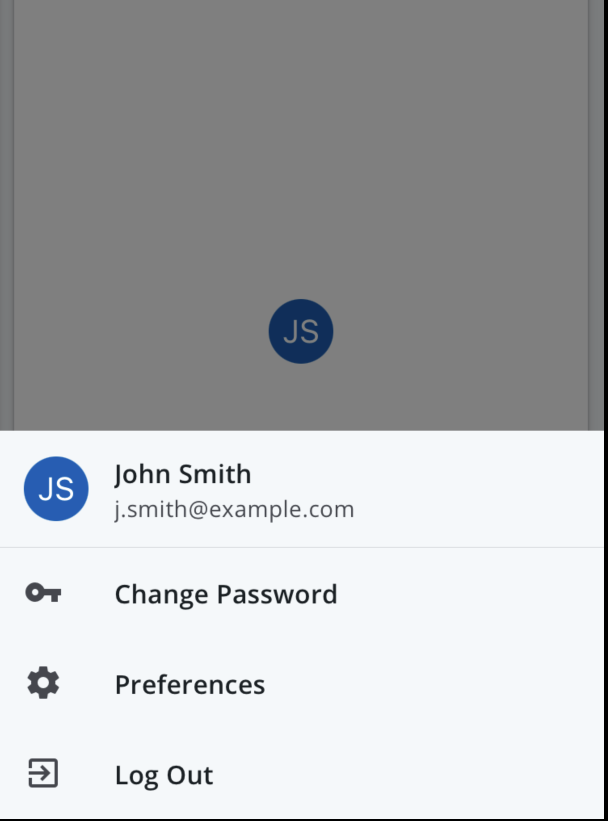

# User Menu

The `<UserMenu>` is an Avatar that opens a Menu when clicked. It is typically used in the top-right corner of an application and indicates who is logged in.

<div style="align-items: center; display:flex; justify-content: space-around">




</div>

## Usage

```tsx
import { UserMenu } from '@pxblue/react-native-components';
...
<UserMenu
    menuTitle={'John Smith'}
    menuSubtitle={'j.smith@example.com'}
    menuItems={[
        { title: 'Change Password', IconClass: VpnKeyIcon },
        { title: 'Preferences', IconClass: SettingsIcon },
        { title: 'Log Out', IconClass: ExitToAppIcon },
    ]}
    avatar={<Avatar.Text label={'PX'} size={40} />}
/>
```

## API

<div style="overflow: auto">

| Prop Name       | Description                                                                          | Type                  | Required | Default             |
| --------------- | ------------------------------------------------------------------------------------ | --------------------- | -------- | ------------------- |
| avatar          | Avatar to be displayed as UserMenu bottomsheet trigger                               | `JSX.Element`         | yes      |                     |
| backgroundColor | Background color of the bottomsheet                                                  | `string`              | no       |                     |
| fontColor       | Color of font for the bottomsheet header and menu items                              | `string`              | no       |                     | 
| iconColor       | Color of icons for the bottomsheet menu items                                        | `string`              | no       |                     | 
| menuItems       | Menu items to display in the bottomsheet                                             | `InfoListItemProps[]` | yes      |                     |
| menuTitle       | Title shown when bottomsheet is open                                                 | `string`              | no       |                     |
| menuSubtitle    | Subtitle shown when bottomsheet is open                                              | `string`              | no       |                     |

</div>

### Styles

You can override the internal styles used by PX Blue by passing a `styles` prop. It supports the following keys:

| Name        | Description                               |
| ----------- | ----------------------------------------- |
| root        | Styles applied to the root element        |
| avatar      | Styles applied to avatar wrapper          |
| bottomsheet | Styles applied to the bottomsheet wrapper |