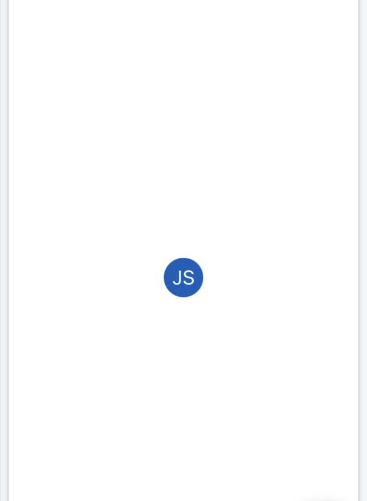

# User Menu

The `<UserMenu>` is an Avatar that opens a Menu when clicked. It is typically used in the top-right corner of an application and indicates who is logged in.

<div style="align-items: center; display:flex; justify-content: space-around">




</div>

## Usage

```tsx
import { UserMenu } from '@brightlayer-ui/react-native-components';

<UserMenu
    menuTitle={'John Smith'}
    menuSubtitle={'j.smith@example.com'}
    menuItems={[
        { title: 'Change Password', icon: { name: 'vpn-key' } },
        { title: 'Preferences', icon: { name: 'settings' } },
        { title: 'Log Out', icon: { name: 'exit-to-app' } },
    ]}
    avatar={<Avatar.Text label={'BLUI'} size={40} />}
/>;
```

## API

<div style="overflow: auto">

| Prop Name       | Description                                              | Type                          | Required | Default                         |
| --------------- | -------------------------------------------------------- | ----------------------------- | -------- | ------------------------------- |
| avatar          | Avatar to display as the menu trigger                    | `JSX.Element`                 | yes      |                                 |
| backgroundColor | Background color of the bottom sheet                     | `string`                      | no       | `theme.colors.surface`          |
| fontColor       | Color of text for the bottom sheet header and menu items | `string`                      | no       |                                 |
| iconColor       | Color of icons for the bottom sheet menu items           | `string`                      | no       | `theme.colors.onSurfaceVariant` |
| menuItems       | An array of menu items to show in the bottom sheet       | `InfoListItemProps[]`         | yes      |                                 |
| menuTitle       | Title to display in the bottom sheet                     | `string`                      | no       |                                 |
| menuSubtitle    | Subtitle to display in the bottom sheet                  | `string`                      | no       |                                 |
| theme           | Theme value overrides                                    | `$DeepPartial<ExtendedTheme>` | no       |                                 |

</div>

### Styles

You can override the internal styles used by Brightlayer UI by passing a `styles` prop. It supports the following keys:

| Name        | Description                               |
| ----------- | ----------------------------------------- |
| root        | Styles applied to the root element        |
| avatar      | Styles applied to avatar wrapper          |
| bottomsheet | Styles applied to the bottomsheet wrapper |
