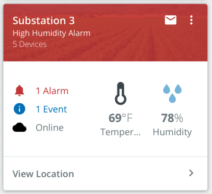

# ScoreCard 
Card component that calls attention to particular values.

<br/>


## Usage
```typescript
import { Hero, HeroBanner, Body, ScoreCard, wrapIcon } from '@pxblue/react-native-components';
import { ListItem } from 'react-native-elements';
import MatIcon from 'react-native-vector-icons/MaterialIcons';
import _A from '@pxblue/icons-svg/grade_a.svg';
const A = wrapIcon({ IconClass: _A });
const MoreIcon = wrapIcon({ IconClass: MatIcon, name: 'more-vert' });
...
<ScoreCard
    headerTitle={'Portland Datacenter Long Name'}
    headerSubtitle={'6 UPS Devices'}
    actionItems={[
        { icon: MoreIcon, onPress: () => { } }
    ]}
    badgeOffset={-55}
    badge={
        <HeroBanner style={{ flex: 0, minWidth: 80, justifyContent: 'flex-end' }}>
            <Hero
                label={'Score'}
                iconSize={48}
                iconColor={PXBColors.green[500]}
                value={98}
                units={'/100'}
                IconClass={A}
            />
        </HeroBanner>
    }
    actionRow={
        <ScoreCard.ListItem label={'View Location'} onPress={() => { }} />
    }
>
    <ListItem
        leftIcon={<MatIcon name={'notifications'} size={24} />}
        title={<Body color={'error'}>1 Alarm</Body>}
    />
</ScoreCard>
```

## API

<div style="overflow: auto">

| Prop Name             | Description                                 | Type                  | Required | Default                  |
|-----------------------|---------------------------------------------|-----------------------|----------|--------------------------|
| headerTitle           | The primary text                            | `string`              | yes      |                          |
| headerSubtitle        | The secondary text                          | `string`              | no       |                          |
| headerInfo            | Tertiary text (hidden on collapse)          | `string`              | no       |                          |
| headerColor           | The color of the header                     | `string`              | no       | `theme.colors.primary`   |
| headerFontColor       | The color for text and icons in header      | `string`              | no       | `theme.colors.onPrimary` |
| headerBackgroundImage | An image to display in the header           | `ImageSourcePropType` | no       |                          |
| actionItems           | Icons to show to the right of the text      | `HeaderIcon[]`        | no       |                          |
| badge                 | The component to render in the callout area | `React.Component`     | no       |                          |
| badgeOffset           | Vertical offset for the badge component     | `number`              | no       |                          |
| actionRow             | Component to render for the footer          | `React.Component`     | no       |                          |
| theme                 | Theme partial for default styling           | `DeepPartial<Theme>`  | no       |                          |

</div>

#### HeaderIcon
Header icons specified as a JSON object with the following properties:

<div style="overflow: auto">

| Key               | Description                             | Type                                               | Required | Default             |
|-------------------|-----------------------------------------|----------------------------------------------------|----------|---------------------|
| icon              | A component to render for the icon      | `React.Component<{ size: number, color: string }>` | yes      |                     |
| onPress           | A function to execute when clicked      | `function`                                         | yes      |                     |

</div>

#### ScoreCard.ListItem
ScoreCard.ListItem is a helper component that can be used for the footer of the ScoreCard. 

```typescript
import { ScoreCard } from '@pxblue/react-native-components';
...
<ScoreCard.ListItem label={'View Location'} onPress={() => { }} />
```


<div style="overflow: auto">

| Prop Name | Description                             | Type       | Required | Default |
|-----------|-----------------------------------------|------------|----------|---------|
| label     | Text to show in the action row          | `string`   | yes      |         |
| onPress   | Callback function for onPress event     | `function` | no       |         |

</div>
